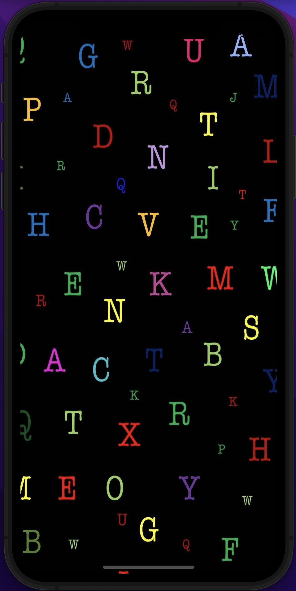
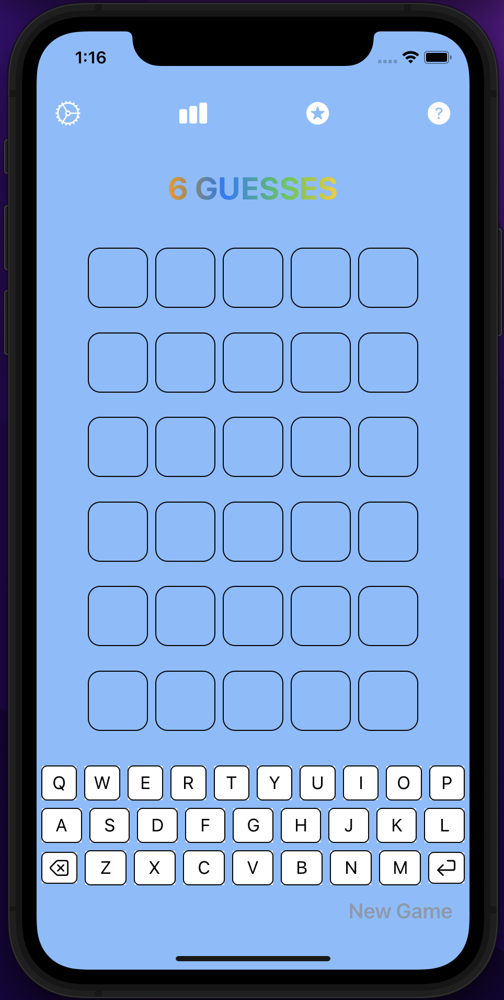
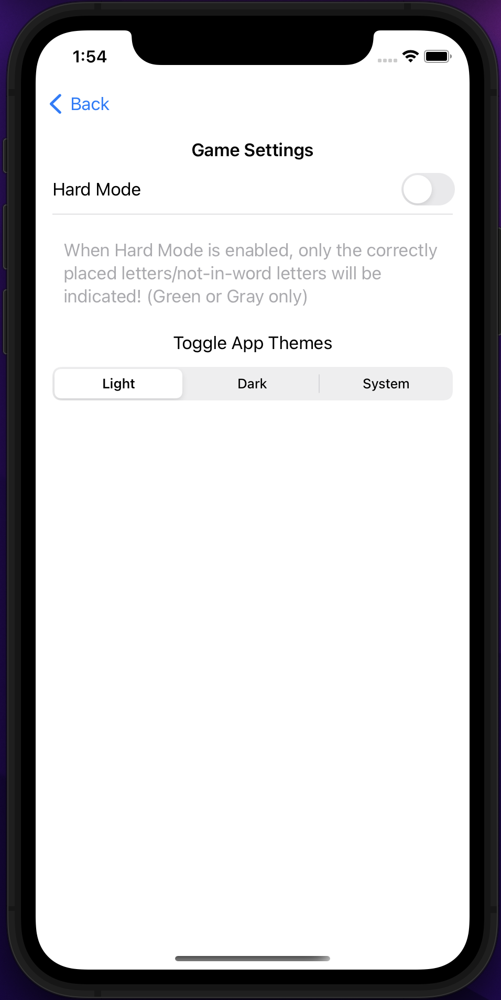
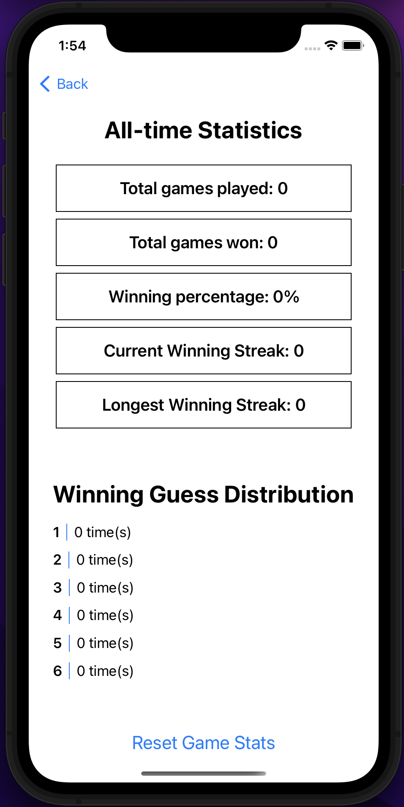
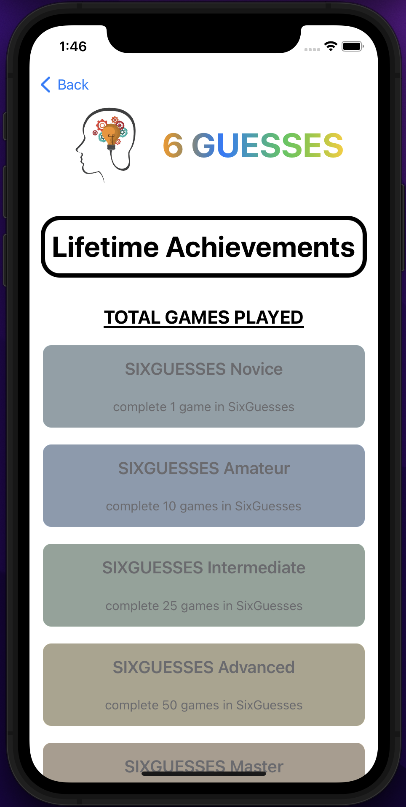
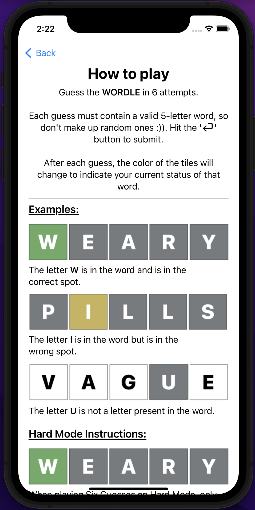
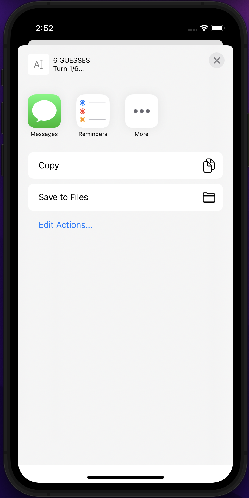

# 6 Guesses App (WORDLE Type Game!)

  

"The WORDLE sensation all linguists know and love, remastered on the best tech platform (Apple)"

## 📖 Description

- This is an iOS application, inspired from my immense passion for the English language, particularly the complex lexical resource (vocabulary) it encompasses :))
- The main content is essentially a Game Board divided into 6 rows, along with a self-designed keyboard interface for users to input 5-letter words as their guesses
- The resources that drive the operation of this game is a simple text file containing 3000+ English words containing 5 letters (susceptible to future additions) and several logic processing files to supply the main view with a randomly-generated word everytime a new game is invoked by the player!

   
   
   
   
  
  
   
   
  
  
   

## 🔮 Live Demo (GIF Animation)

<table align="center">
  <tr>
     <td>6 Guesses App with classic game functionalities, adjustable settings and a definition search query available for all the words available in the database</td>
  </tr>
  <tr>
    <td align="center">
        
    </td>
   </tr>
 </table>

## 🔧 Build Information
- Xcode 13.4.1
- SwiftUI Framework
- Target Deployment iOS >=15.5
- Built-in Library(s): AVFoundation for the stock sound effects and custom MP3 files

## 🏆 Author
- Giang Nhat Khanh (Kayden) - nhatkhanhgiang2512@gmail.com
- LinkedIn - [Check out my LinkedIn Profile](https://www.linkedin.com/in/nhatkhanhgiang2512/)
- GitHub - [Check out my GitHub Profile](https://github.com/KaydenGiang2512)
